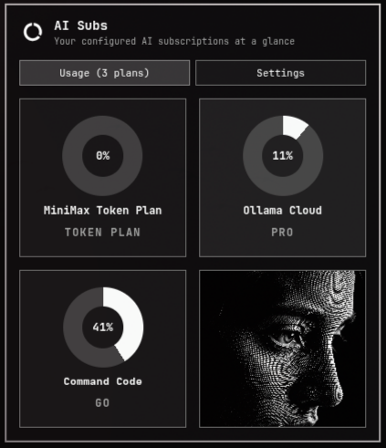
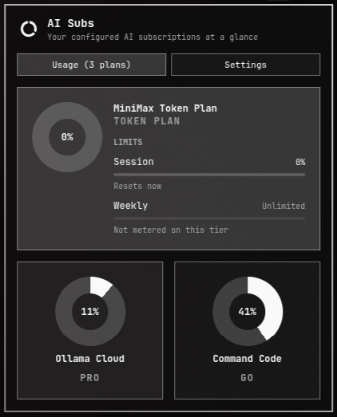

# AI Sub Monitor

Donut tiles on the Omarchy bar for six coding-plan subscriptions: **Kimi Code**, **GLM Coding Plan**, **MiniMax Token Plan**, **Ollama Cloud**, **Kilo Pass**, and **Command Code**. Keys stay in a local env file. The plugin does not scrape cookies, impersonate OAuth apps, or hit PAYG wallets.

Plugin id: `io.github.spenceriam.ai-sub-monitor`. License: MIT.





## Install

```sh
omarchy plugin add https://github.com/spenceriam/ai-sub-plugin.git --enable
```

That clones into `~/.config/omarchy/plugins/` and reloads omarchy-shell. If the session is locked, a reload can kill the lock screen.

`--enable` places the widget in the bar’s right section. To put it after Activity Monitor:

```sh
omarchy plugin enable io.github.spenceriam.ai-sub-monitor --section right --after stappmus.activity-monitor
```

Python 3 is required (`collect.py` uses the stdlib only). No extra packages, daemons, or sudo.

## Usage

- First click with no saved keys opens **Settings** (pick one plan, paste the key, **Save and test**).
- After a key is saved: left-click **Usage**, right-click **Settings**, middle-click switches. The same view again closes the panel.
- Click a tile to expand or collapse it. Hold or drag a collapsed tile to reorder.
- `s` Settings, `u` Usage, `h`/`l` switch tabs, `r` refresh, Esc close.

Usage lists saved plans that are not hidden. The Settings eye (󰈈) hides a tile without removing the key. Missing a plan? Request it from the bottom of Settings.

## Configure

```sh
omarchy bar move io.github.spenceriam.ai-sub-monitor --section right
```

Do not put API keys in `shell.json`. Save them in Settings, which writes `~/.config/ai-sub-monitor/keys.env` (directory `0700`, file `0600`). Override path: `AI_SUB_MONITOR_ENV`. Existing environment variables win over the file.

| Plan | Provider | Env var |
|---|---|---|
| Kimi Code | Moonshot AI | `KIMI_API_KEY` |
| GLM Coding Plan | Z.ai | `ZAI_API_KEY` |
| MiniMax Token Plan | MiniMax | `MINIMAX_API_KEY` |
| Ollama Cloud | Ollama | `OLLAMA_API_KEY` |
| Kilo Pass | Kilo | `KILO_API_KEY` |
| Command Code | Command Code | `COMMAND_CODE_API_KEY` |

Use a Code Console / coding-plan / Subscription / gateway / Studio key — not Moonshot/Z.AI wallets, MiniMax PAYG, or Kilo BYOK provider keys. China hosts: `ZAI_HOST` or `MINIMAX_HOST` in the env file. Kilo org wallet: `KILO_ORG_ID`.

Bar setting `refreshIntervalSec` (30–3600, default 300) is the usage poll interval. Density, tile order, and hidden plans persist in `$XDG_STATE_HOME/omarchy/ai-sub-monitor/ui.json`.

## Remove

```sh
omarchy plugin remove io.github.spenceriam.ai-sub-monitor
```

That disables the widget and deletes the plugin checkout. Keys and UI state are left in place. To delete those too:

```sh
rm -rf ~/.config/ai-sub-monitor
rm -f ~/.config/omarchy/ai-sub-monitor.env
rm -rf "${XDG_STATE_HOME:-$HOME/.local/state}/omarchy/ai-sub-monitor"
```

## Dependencies

- **Python 3** (stdlib). `collect.py` calls each provider’s usage HTTP API with the saved Bearer/Authorization key.
- **Omarchy notifications** via `omarchy notification send` (not `notify-send`): plan added, key/usage failure, usage ≥ 90%.
- Network to: `api.kimi.com`, `api.z.ai` (or `open.bigmodel.cn`), `api.minimax.io` (or `api.minimaxi.com`), `ollama.com`, `app.kilo.ai` / `api.kilo.ai`, `api.commandcode.ai`.
